# 화성형 팔란티어 시스템 (Hwaseong Palantir System)

"흩어진 도시 데이터를 하나의 언어로 연결한다"

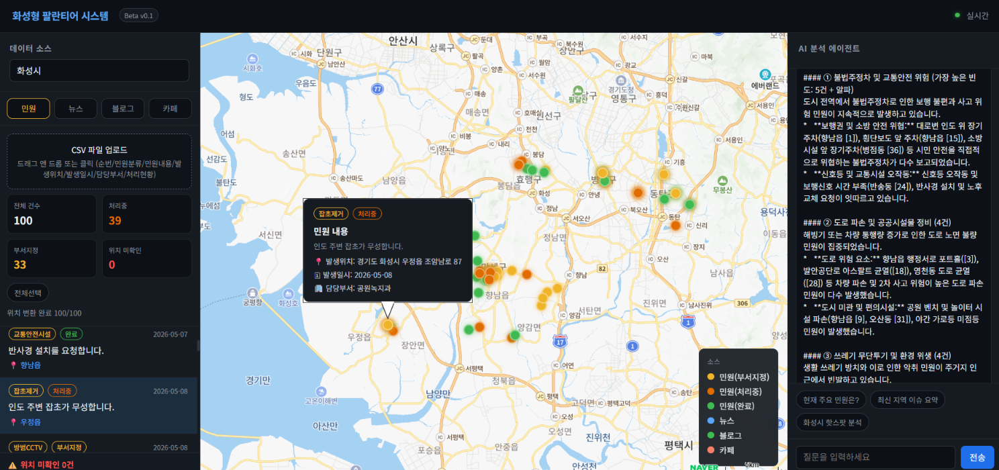
---

## 왜 이 사업을 시작했는가

### 도시 데이터의 단절 문제

대한민국의 지방자치단체는 수십 개의 부서가 각자의 방식으로 데이터를 생산한다. 도로 개설 정보는 건설과에, 민원 현황은 민원실에, 환경 이슈는 환경과에, 복지 수요는 복지과에 각각 고립되어 있다. 뉴스와 SNS에서 쏟아지는 시민의 목소리는 어디에도 체계적으로 수집되지 않는다.

결과적으로 도시 관리자는 파편화된 정보 속에서 의사결정을 내려야 한다. 어느 지역에 어떤 민원이 집중되는지, 특정 개발사업이 지역사회에 어떤 반응을 일으키는지, 시민들이 실제로 체감하는 불편이 무엇인지를 한눈에 파악할 수 있는 수단이 없다.

이것이 이 프로젝트의 출발점이다.

---

## 온톨로지로 단절을 해결한다

### 온톨로지란 무엇인가

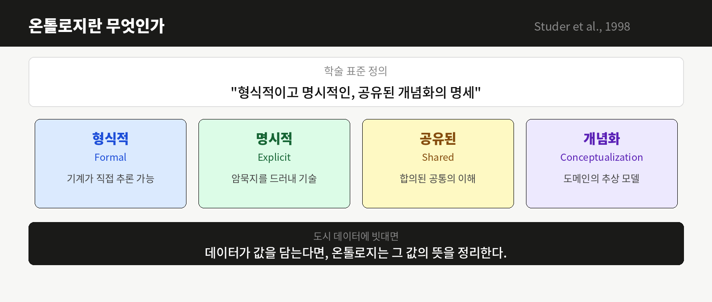

온톨로지(Ontology)란 서로 다른 출처의 데이터를 공통된 개념 체계로 연결하는 기술이다. Studer et al.(1998)의 학술 표준 정의에 따르면 온톨로지는 "형식적이고 명시적인, 공유된 개념화의 명세(a formal, explicit specification of a shared conceptualization)"다.

네 가지 핵심 속성이 있다.

- 형식적(Formal): 기계가 직접 추론할 수 있는 형식
- 명시적(Explicit): 암묵지를 드러내 개념과 제약을 기술
- 공유된(Shared): 개인을 넘어 합의된 공통의 이해
- 개념화(Conceptualization): 도메인의 추상 모델

도시 데이터에 빗대면, 온톨로지는 도시의 표준 용어집이자 개념 지도다. 측정소·읍면동·관측값 같은 도시 개념들이 어떤 관계로 연결되는지를 모든 시스템이 공유하는 형태로 드러낸다. 데이터가 값을 담는다면, 온톨로지는 그 값의 뜻을 정리한다.

### 왜 도시 데이터에 온톨로지가 필요한가

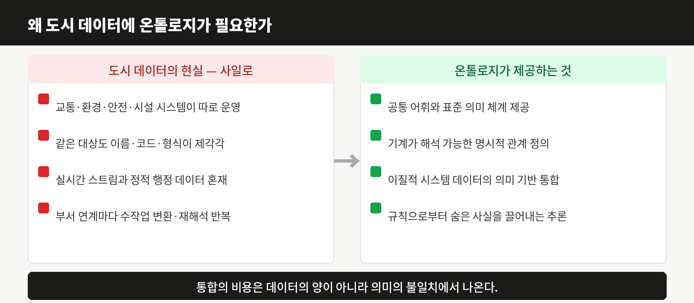

화성시의 현실을 보면 문제가 명확하다. 교통·환경·안전·시설 시스템이 따로 구축되어 운영되고, 같은 대상도 시스템마다 이름·코드·형식이 제각각이다. 실시간 스트림과 정적 행정 데이터가 뒤섞여 있고, 부서 간 연계가 필요할 때마다 수작업 변환과 재해석이 반복된다.

통합의 비용은 데이터의 양이 아니라 의미의 불일치에서 나온다.

온톨로지는 이 문제를 구조적으로 해결한다.

- 도시 개념에 대한 공통 어휘와 표준 의미 체계 제공
- 기계가 직접 해석할 수 있는 명시적 관계 정의
- 이질적 시스템 데이터의 의미 기반 통합
- 규칙으로부터 명시되지 않은 사실을 끌어내는 추론

민원 데이터의 "동탄2동"과 뉴스 데이터의 "동탄신도시", 블로그의 "동탄역 근처"는 모두 같은 공간을 가리키지만 기존 시스템에서는 연결되지 않는다. 온톨로지가 이 세 표현을 하나의 국가기초구역 코드로 연결하는 순간, 흩어져 있던 데이터가 하나의 의미로 모인다.

### 온톨로지 설계 원칙 (Gruber, 1995)

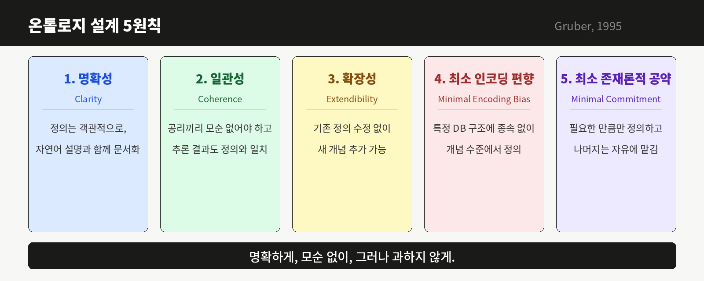

좋은 온톨로지는 다섯 가지 원칙을 따른다.

- 명확성(Clarity): 정의는 객관적으로, 자연어 설명과 함께 문서화한다
- 일관성(Coherence): 공리들끼리 모순이 없어야 하고, 추론 결과도 정의와 어긋나지 않아야 한다
- 확장성(Extendibility): 기존 정의를 고치지 않고도 새 개념을 추가할 수 있어야 한다
- 최소 인코딩 편향(Minimal Encoding Bias): 특정 구현 기술이나 DB 컬럼 구조에 종속되지 않게 개념 수준에서 정의한다
- 최소 존재론적 공약(Minimal Commitment): 합의가 필요한 만큼만 정의하고 나머지는 시스템의 자유에 맡긴다. 처음부터 도시 전체를 모델링하지 않는다

명확하게, 모순 없이, 그러나 과하지 않게.

### 기술 기반: 시맨틱 웹 표준 스택

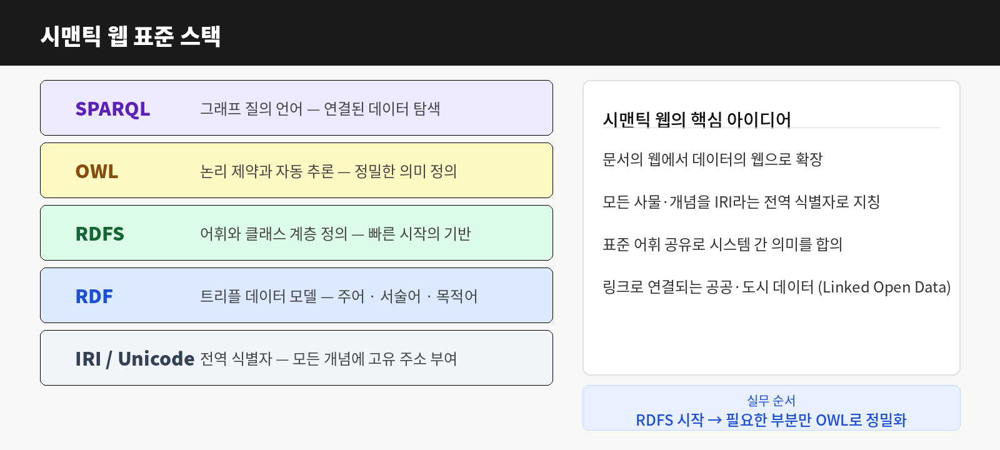

화성형 팔란티어 시스템의 온톨로지는 W3C 시맨틱 웹 표준 스택 위에 구축된다.

| 레이어 | 기술 | 역할 |
|--------|------|------|
| 질의 | SPARQL | 그래프 질의 언어 |
| 논리 | OWL | 논리 제약과 자동 추론 |
| 어휘 | RDFS | 어휘와 클래스 계층 정의 |
| 데이터 | RDF | 트리플(주어-서술어-목적어) 데이터 모델 |
| 식별 | IRI / Unicode | 전역 식별자 |

RDFS로 빠르게 시작하고, 추론이 필요한 부분만 OWL로 정밀하게 다듬는 것이 실무 순서다.

### 재사용 표준 어휘

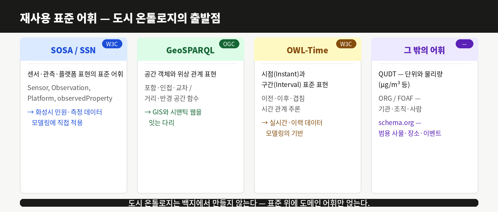

도시 온톨로지는 백지에서 만들지 않는다. 검증된 표준 어휘를 재사용하고 도메인 어휘만 얹는다.

| 표준 | 제정 | 용도 |
|------|------|------|
| SOSA / SSN | W3C | 센서·관측·플랫폼 표현 (Sensor, Observation, Platform) |
| GeoSPARQL | OGC | 공간 객체와 위상 관계(포함·인접·교차), GIS와 시맨틱 웹을 잇는 다리 |
| OWL-Time | W3C | 시점(Instant)과 구간(Interval), 이전·이후·겹침 시간 관계 추론 |
| QUDT | — | 단위와 물리량 (μg/m³ 등) |
| schema.org | — | 범용 사물·장소·이벤트 |

### 화성형 시스템에서의 적용

온톨로지 기반 도시 데이터 플랫폼은 장소, 시간, 주제, 감성이라는 4개 축으로 모든 데이터를 정렬함으로써 단절되어 있던 정보들을 의미 있는 패턴으로 연결한다.

특정 지역의 교통 민원이 급증하는 시점과 신규 아파트 입주 시기가 겹친다는 사실, 특정 공원 인근에서 안전 관련 게시글이 반복적으로 올라온다는 패턴이 비로소 가시화된다. 이것이 온톨로지가 없는 단순 데이터 수집과 온톨로지 기반 도시 인텔리전스 플랫폼의 근본적인 차이다.

---

## 팔란티어의 우수사례에서 배운다

### 팔란티어 4대 플랫폼 — 화성시 적용 가능성

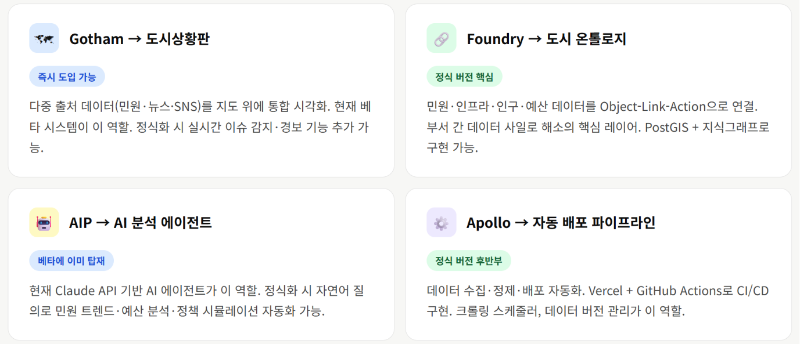

### 팔란티어 VS 화성형 — 핵심 차이

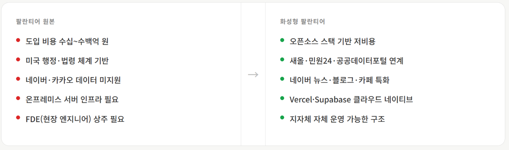

### 도입 필수 요소

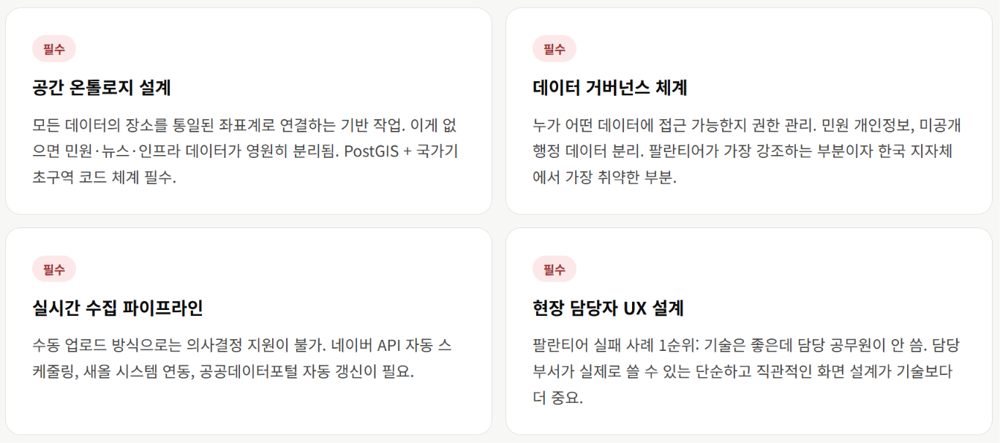

### 단계별 구축 로드맵

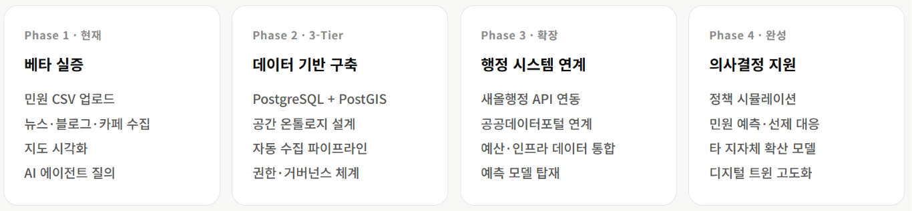

팔란티어(Palantir Technologies)는 2003년 미국에서 설립된 데이터 분석 플랫폼 기업이다. CIA, FBI, 미 국방부를 시작으로 현재는 영국 NHS, 우크라이나 국방부, 여러 지방정부에 이르기까지 복잡한 다중 출처 데이터를 통합하여 의사결정을 지원하는 시스템을 구축해왔다.

팔란티어의 4대 플랫폼과 화성형 시스템의 대응 관계는 아래와 같다.

| 팔란티어 플랫폼 | 역할 | 화성형 대응 |
|----------------|------|------------|
| Gotham | 다중 출처 데이터 통합 시각화 | 네이버 지도 기반 도시상황판 |
| Foundry | 데이터 온톨로지 및 파이프라인 | 국가기초구역 공간 온톨로지 + PostGIS |
| AIP | AI 기반 분석 및 의사결정 지원 | Claude API 기반 AI 분석 에이전트 |
| Apollo | 자동 배포 및 운영 파이프라인 | Vercel + GitHub Actions CI/CD |

팔란티어가 증명한 것은 기술 자체가 아니다. 흩어진 데이터를 연결했을 때 의사결정의 질이 근본적으로 달라진다는 것이다.

### 팔란티어 vs 화성형 — 핵심 차이

팔란티어는 강력하지만 한국 지방정부 환경에 그대로 적용하기 어렵다.

| 항목 | 팔란티어 원본 | 화성형 팔란티어 |
|------|-------------|----------------|
| 도입 비용 | 수십~수백억 원 | 오픈소스 스택 기반 저비용 |
| 행정 체계 | 미국 행정·법령 기반 | 새올·민원24·공공데이터포털 연계 |
| 데이터 생태계 | 미국 플랫폼 중심 | 네이버 뉴스·블로그·카페 특화 |
| 인프라 | 온프레미스 서버 필요 | Vercel·Supabase 클라우드 네이티브 |
| 운영 방식 | FDE 현장 엔지니어 상주 | 지자체 자체 운영 가능한 구조 |

### 도입 필수 요소

아래 네 가지가 없으면 시스템이 작동하지 않는다.

공간 온톨로지 설계 — 모든 데이터의 장소를 통일된 좌표계로 연결하는 기반 작업이다. 이것이 없으면 민원·뉴스·인프라 데이터는 영원히 분리된 상태로 남는다.

데이터 거버넌스 체계 — 누가 어떤 데이터에 접근 가능한지 권한을 관리하고, 민원 개인정보와 미공개 행정 데이터를 분리하는 체계다. 팔란티어가 가장 강조하는 부분이자 한국 지자체에서 가장 취약한 부분이기도 하다.

실시간 수집 파이프라인 — 수동 업로드 방식으로는 의사결정 지원이 불가능하다. 네이버 API 자동 스케줄링, 새올 시스템 연동, 공공데이터포털 자동 갱신이 필요하다.

현장 담당자 UX 설계 — 팔란티어 실패 사례의 1순위 원인은 기술은 좋은데 담당 공무원이 쓰지 않는 것이다. 담당 부서가 실제로 쓸 수 있는 단순하고 직관적인 화면 설계가 기술보다 더 중요하다.

### 단계별 구축 로드맵

| 단계 | 내용 |
|------|------|
| Phase 1 · 현재 | 민원 CSV 업로드, 뉴스·블로그·카페 수집, 지도 시각화, AI 에이전트 질의 |
| Phase 2 · 3-Tier | PostgreSQL + PostGIS, 공간 온톨로지 설계, 자동 수집 파이프라인, 거버넌스 체계 |
| Phase 3 · 확장 | 새올행정 API 연동, 공공데이터포털 연계, 예산·인프라 데이터 통합, 예측 모델 탑재 |
| Phase 4 · 완성 | 정책 시뮬레이션, 민원 예측 및 선제 대응, 타 지자체 확산 모델, 디지털 트윈 고도화 |

---

## 화성시를 시작점으로 선택한 이유

화성시는 대한민국에서 가장 빠르게 성장하는 기초자치단체 중 하나다. 동탄신도시를 비롯한 대규모 택지개발, 삼성전자 반도체 클러스터, 급증하는 인구와 함께 도시 관리의 복잡성도 폭발적으로 증가하고 있다. 다양한 계층의 시민, 다양한 유형의 민원, 빠르게 변화하는 도시 구조는 데이터 통합 플랫폼의 필요성을 가장 명확하게 보여주는 환경이다.

화성시에서 작동하는 시스템은 대한민국 어느 도시에도 적용할 수 있다.

---

## 공간 데이터 체계

화성시 도시현황에 대한 심층적 분석을 위해, 기존 시군구와 행정동 단위의 공간분석에서 벗어나, 격자와 국가기초구역(우편번호) 단위로 데이터 해상도를 높여 시스템을 구축한다.

**격자 ←→ 국가기초구역 (우편번호 5자리)**

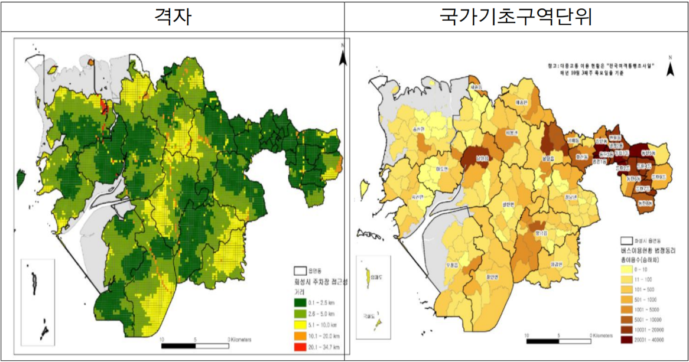

데이터 소스별 공간 처리 방식:

| 데이터 소스 | 원본 공간 정보 | 변환 방식 | 저장 단위 |
|-------------|---------------|-----------|----------|
| 민원 데이터 | 도로명주소 | 지오코딩 → 좌표 + 우편번호 추출 | 좌표 + 국가기초구역 |
| 뉴스·블로그 | 텍스트 내 장소명 | Claude NER → 지오코딩 | 좌표 + 국가기초구역 |
| 인프라 시설 | 좌표 | 역지오코딩 → 우편번호 매핑 | 좌표 + 국가기초구역 |

---

## 개인정보 비식별화 처리 체계

민원 데이터 연계 시 개인정보보호법 및 공공데이터 제공 및 이용 활성화에 관한 법률에 따라 수집 단계에서 비식별화·삭제 처리를 원칙으로 한다.

| 항목 | 원본 | 처리 방식 | 시스템 저장값 |
|------|------|-----------|--------------|
| 민원인 성명 | 홍길동 | 완전 삭제 | null |
| 주민등록번호 | 800101-1****** | 완전 삭제 | null |
| 연락처 | 010-1234-5678 | 완전 삭제 | null |
| 상세주소 | 동탄역로 27, 101동 302호 | 도로명+건물번호까지만 | 동탄역로 27 |
| 민원 내용 | 이름·연락처 포함 서술 | Claude API 마스킹 처리 | 개인정보 제거 텍스트 |
| 처리 담당자 | 김○○ 주무관 | 부서명만 유지 | 도로관리과 |

비식별화 처리 흐름:

```
민원 원본 데이터 (새올행정시스템)
    ↓
개인정보 필드 자동 삭제 (ETL 파이프라인)
    ↓
Claude API — 민원 내용 내 잔존 개인정보 마스킹
    ↓
상세주소 → 도로명 + 건물번호 truncation
    ↓
국가기초구역 코드 매핑
    ↓
화성형 팔란티어 시스템 DB 저장
```

시스템 저장 최종 데이터 구조:

```json
{
  "id": "민원고유번호(익명)",
  "category": "불법주정차",
  "content": "대로변 인도 위 차량 장기주차로 보행 불편 (개인정보 제거)",
  "postal_code": "18471",
  "address_road": "향남읍 행정동로",
  "lat": 37.0764,
  "lng": 126.9946,
  "department": "주차교통과",
  "status": "처리중",
  "created_at": "2026-05-03",
  "name": null,
  "phone": null,
  "resident_id": null
}
```

---

## 데이터 거버넌스 체계

화성형 팔란티어 시스템의 데이터 거버넌스는 도시데이터 정책협의체와 실행협의체 이원 체계로 운영한다. (근거: 화성시 데이터관리지침 제14조)

### 정책협의체 (Policy Layer)

위원장: 제1부시장 / 부위원장: 제2부시장
구성: 실장·국장·소장급 30명 이내

심의·조정 사항:
- 도시상태 정의
- 부서별 문제상태 정의 및 기준
- 핵심 데이터 지정 및 관리 방향

### 실행협의체 (Execution Layer)

위원장: 과장급 / 부위원장: 팀장급
구성: 과장·팀장·정보시스템·공공데이터 담당자 30명 이내

협의·실행 사항:
- 데이터 표준 적용 및 메타데이터 관리
- 데이터 품질 점검 및 오류·중복 개선
- DB 연계, 부서 간 데이터 공유
- 공공데이터 개방 및 활용 확대
- 도시상태 기반 데이터 분석 및 정책 활용 지원

### 거버넌스와 시스템의 연결

| 거버넌스 사항 | 시스템 구현 항목 |
|--------------|----------------|
| 도시상태 정의 | 데이터 수집 키워드·카테고리 분류 체계 |
| 핵심 데이터 지정 | DB 스키마 우선순위 및 수집 주기 설정 |
| 데이터 표준 적용 | 국가기초구역 코드 기준 공간 단위 통일 |
| 메타데이터 관리 | 수집 출처·일시·가공 이력 자동 기록 |
| 개인정보 비식별화 | ETL 파이프라인 자동 마스킹 처리 |
| 품질 점검 결과 | 지오매핑 실패 항목 별도 관리 패널 |
| 부서 간 데이터 공유 | 권한별 접근 제어 (RBAC) |
| 공공데이터 개방 | 비식별화 완료 데이터 API 개방 |

---

## 시스템 구조

### Beta v0.1 — 현재

```
네이버 뉴스·블로그·카페  →  수집 API
민원 CSV 데이터          →  파일 파서
                               ↓
                        Claude AI 엔진
                     (장소 추출 + 분석)
                               ↓
                        네이버 지도 시각화
                               ↓
                        AI 분석 에이전트
                      (자연어 질의응답)
```

### 정식 버전 3-Tier — 목표

| 레이어 | 기술 스택 | 역할 |
|--------|-----------|------|
| 프론트엔드 | React + Vite | 대시보드, 지도, AI 채팅 UI |
| API 서버 | Node.js + Express | 크롤러, AI 파이프라인, 온톨로지 엔진 |
| 데이터 | PostgreSQL + PostGIS + Redis | 공간 데이터 저장, 캐시, 스케줄링 |

---

## 배포 및 실행

환경변수:

```
NAVER_CLIENT_ID      = 네이버 개발자센터 Client ID
NAVER_CLIENT_SECRET  = 네이버 개발자센터 Client Secret
ANTHROPIC_API_KEY    = Anthropic API 키
```

Vercel 배포:

```bash
npm i -g vercel
cd hwaseong-palantir
vercel --prod
```

파일 구조:

```
hwaseong-palantir/
├── index.html       # 프론트엔드 (3단 레이아웃)
├── api/
│   ├── search.js    # 네이버 검색 API 프록시
│   ├── extract.js   # Claude 장소 추출
│   └── agent.js     # AI 분석 에이전트
├── vercel.json
└── .env.example
```

---

## 비전

대한민국 모든 지방자치단체의 도시 관리자가
흩어진 데이터를 연결하여
더 나은 의사결정을 내릴 수 있도록.

팔란티어가 미국 정부기관에 증명한 것을
한국의 지방정부 현장에서 실현한다.

---

화성형 팔란티어 시스템 — Beta v0.1
Built with Naver Maps API · Naver Search API · Claude AI · Vercel
